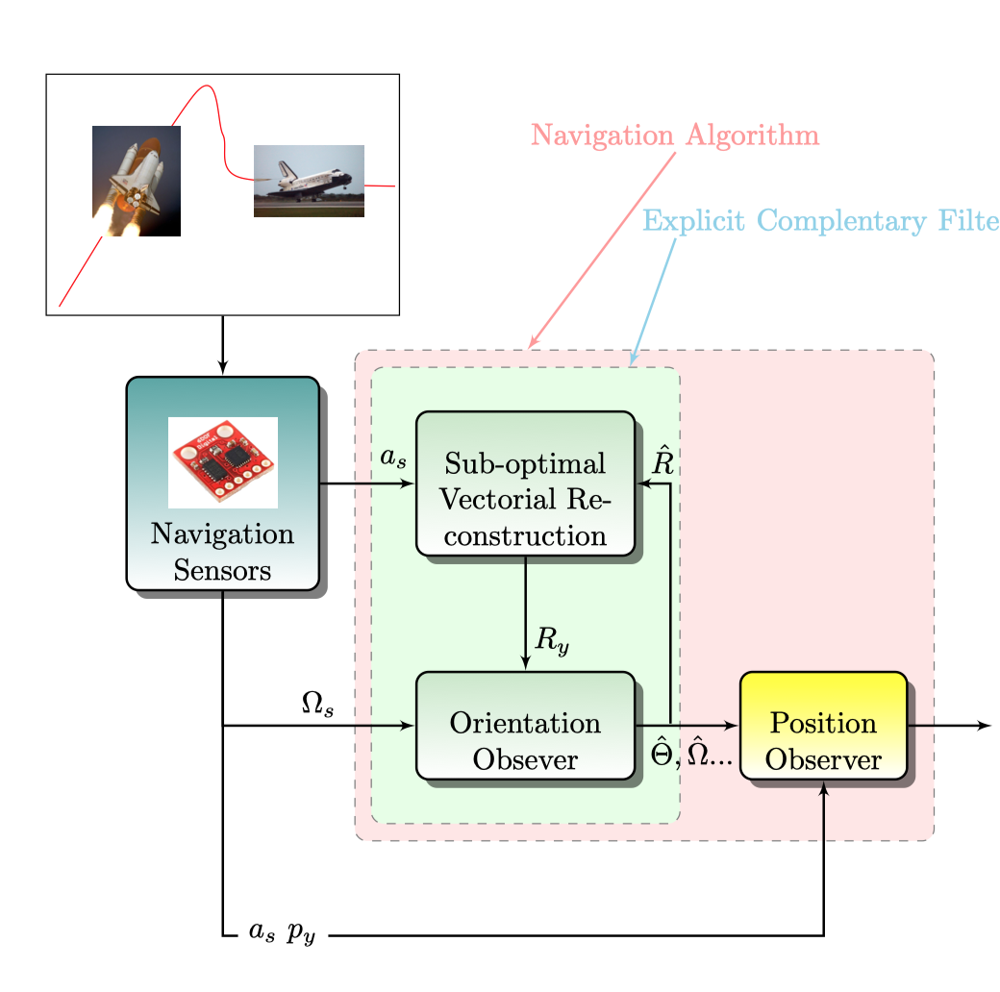

# Rotation Matrix Reconstruction in Quaternions with an Optimal Observer: A Navigation Algorithm Based on Nonlinear Complementary Observers

## Ariel Iporre Rivas∗and Mauricio Amestegui Moreno ́

```
Electronic Engineering - Faculty of Engineering - Universidad Mayor de San Andres ́
La Paz, Bolivia
```
Abstract—This work proposes a variation of an earlier nav-
igation algorithm in the literature composed by SO(3) comple-
mentary observers. Such modification means the inclusion of a
quaternion optimal observer to determine the rotation matrix
instead using the original vectorial reconstruction approach. In
particular, this proposal involves an experimental comparison
between the original and modified method. The results show
about 40% increase for estimation quality while 21% more
complexity using this new approach.
Index Terms—Inertial navigation, Kalman filters, Quaternions,
INS, Navigation Systems, Optimal Observers, Nonlinear Filters

The model estimates the position and orientation of a rigid body from the signals
of accelerometers and gyroscopes.


The results compared with the original methods describe the improvements.


The estimation signals are shown below.


For more information check the paper.
